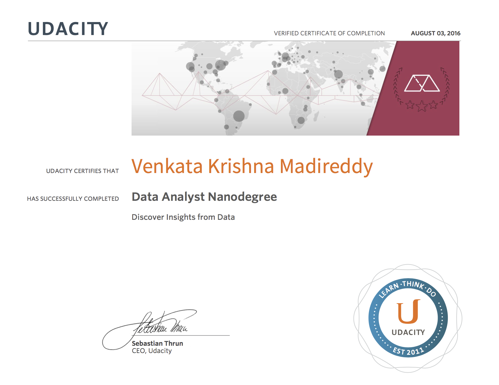

--------------------------------------------
Data Analyst Nanodegree projects
--------------------------------------------

What is it?
----------------------
Projects for completing Data Analyst Nanodegree

List of projects
----------------------
  * project1-perceptual-phenomenon
  * project2-investigating-dataset
  * project3-data-wrangling
  * project4-exploring
  * project5-identify-fraud
  * project6-data-visualization
  * project7-a-b-testing

Certificate
----------------------

