#Introduction

We are exploring the tidy data set which contains red wines with chemical properties of the wine. We would be using EAD methods to explore the dataset to find relationship between wine quality and other properties.

````
# Load all the required packages 
library(ggplot2)
library(gridExtra)
library(dplyr)
library(GGally)
````

#Data set summary

```{r setup, echo=FALSE}
knitr::opts_chunk$set(echo = FALSE)
# Load red wine quality csv file
df <- read.csv("/Users/212444256/Desktop/data-analys/project-04/wineQualityReds.csv")
summary(df)
# Dimensions of the object.
dim(df)
# Internal data structure of the object
str(df)
```


```{r}
# Basic statistics on the quality property
summary(df$quality)
```
Observations:

*   There are 1,599 red wines with 13 variables on the chemical properties of the wine.
*   X seems to be a serial number which is not a property.
*   Quality property is between 3 to 8 with a mean of 5.636 and median of 6
  
#Univariate Plots

````
# Histograms of all the properties from the data set
grid.arrange(qplot(df$fixed.acidity),
             qplot(df$volatile.acidity),
             qplot(df$citric.acid),
             qplot(df$residual.sugar),
             qplot(df$chlorides),
             qplot(df$free.sulfur.dioxide),
             qplot(df$total.sulfur.dioxide),
             qplot(df$density),
             qplot(df$pH),
             qplot(df$sulphates),
             qplot(df$alcohol),
             qplot(df$quality),
             ncol = 3)
````
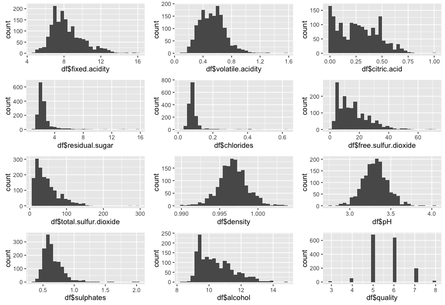
Above histograms will give us a quick overview of the values. 

    *   Normal Distribution: pH and density are normally distributed with few outliers. 
    *   long-tailed: Alcohol, Fixed acidity, Volatile acidity, sulfur dioxide and sulphate  are long-tailed

```
  grid.arrange(qplot(df$residual.sugar,xlab="Residual sugar"), 
               qplot(log10(df$residual.sugar),xlab="log10 Residual sugar"),
               qplot(df$residual.sugar,xlab="Limit Residual sugar")+scale_x_continuous(limits=c(0, 8)), ncol = 3)
```
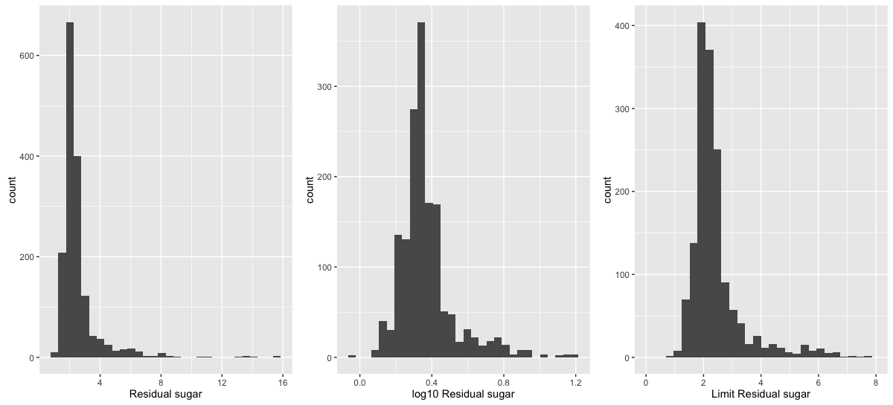

From the above plot Residual sugar seems to have high outliers
```
  grid.arrange(qplot(df$chlorides,xlab="Chlorides"), 
               qplot(log10(df$chlorides),xlab="log10 Chlorides"),
               qplot(df$chlorides,xlab="Limit Chlorides")+scale_x_continuous(limits=c(0, 0.3)), ncol = 3)
```
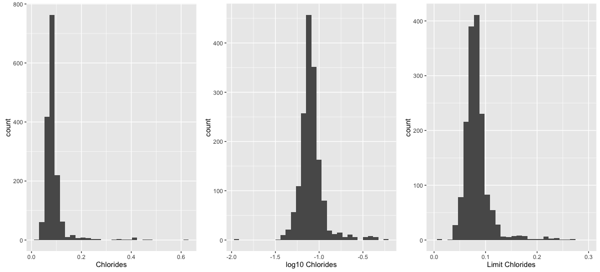
From the above plot Chlorides have high outliers

```
  grid.arrange(qplot(df$total.sulfur.dioxide,xlab="Total Sulfur Dioxide"), 
               qplot(log10(df$total.sulfur.dioxide),xlab="log10 Total Sulfur Dioxide"),
               qplot(df$total.sulfur.dioxide,xlab="Limit Total Sulfur Dioxide")+scale_x_continuous(limits=c(10, 175)), ncol = 3)
```
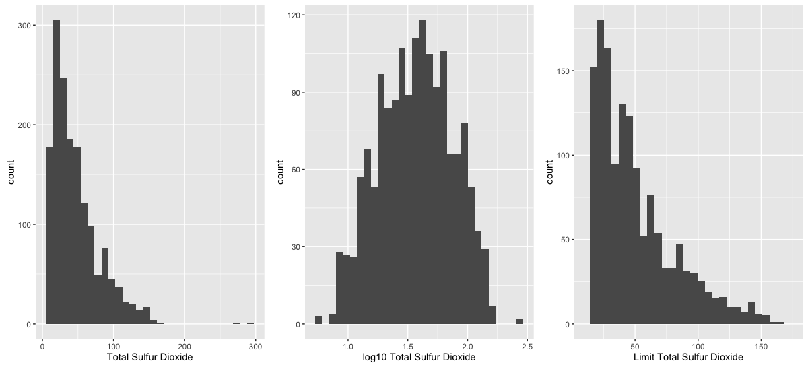

Sulphur dioxide seems to be long tailed.

```
  grid.arrange(qplot(df$sulphates,xlab="Sulphates"), 
               qplot(log10(df$sulphates),xlab="log10 Sulphates"),
               qplot(df$sulphates,xlab="Limit Sulphates")+scale_x_continuous(limits=c(0.1, 1.5)), ncol = 3)
```
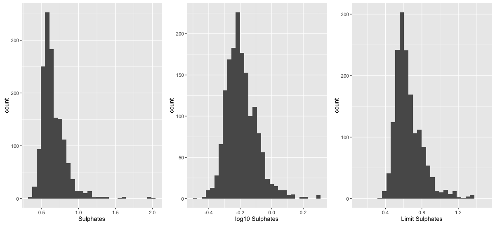

Sulphates seems to be long tailed

Wine quality analysis:

* Quality property is between the range of 3 to 8. Based on the histogram there are more 5 and 6 ratings, and few of them received 3, 4 and 8. There is no use of changing the bin size as that would distort the data.  Based on the ratings and quality we can create a new categorical variable and classify them as Bad, Average, Good and Excellent

    *   Bad       - 0-4
    *   Average   - 5-6
    *   Good      - 7-8
    *   Excellent - 9-10
    
* What other characteristics in the dataset will support investigation?
    *   I considered splitting alcohol into high and low levels but the scale was very low.
* Did I create any other variable by using existing variables in the dataset?
    *   I've created rating categorical variable as 'Bad', 'Average', 'Good', 'Excellent'
* How are the outliers visualized? 
    *   Boxplots are best suited to visualize the outliers

````
# Categorical rating property based on the quality of the winde
df$rating <- ifelse(df$quality < 4, 'Bad', 
             ifelse(df$quality < 6, 'Average',
             ifelse(df$quality < 8, 'Good','Excellent')))
df$rating <- ordered(df$rating,
                     levels = c('Bad', 'Average', 'Good', 'Excellent'))
#Summary of the rating attribute
summary(df$rating)
#Plot rating attribute.
qplot(df$rating)
````
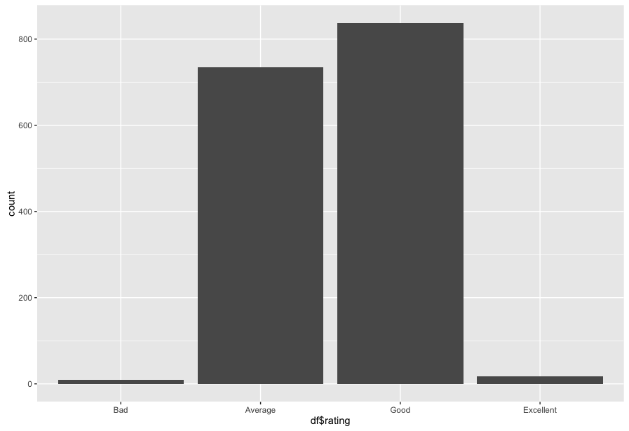


#Bivariate Plots

```
#Common function to generate box plot based on passed in attribute.
get_boxplot <- function(x, y, xlab, ylab) {
  return(qplot(data = df, x = x,
               y = y, geom = 'boxplot',
               ylab = ylab, xlab = xlab))
}

#Common function to generate box plot for quantity based on passed in attributes
get_quantity_boxplot <- function( y, ylab) {
  return(get_boxplot(df$quality, y, 'Quantity', ylab))
}

#Common function to generate box plot for Rating based on passed in attributes
get_rating_boxplot <- function( y, ylab) {
  return(get_boxplot(df$rating, y,'Rating', ylab))
}

#Arrange box plot for quantity and other attributes.
grid.arrange(get_quantity_boxplot( df$fixed.acidity, 'Fixed Acidity'),
             get_quantity_boxplot( df$volatile.acidity, 'Volatile Acidity'),
             get_quantity_boxplot( df$citric.acid, 'Citric acid'),
             get_quantity_boxplot( log10(df$residual.sugar), 'Residual Sugar'),
             get_quantity_boxplot( log10(df$chlorides), 'Chlorides'),
             get_quantity_boxplot( log10( df$volatile.acidity), 'Acidity'),
             get_quantity_boxplot( df$free.sulfur.dioxide, 'Free Sulfur Dioxide'),
             get_quantity_boxplot( df$total.sulfur.dioxide, 'Total Sulfur Dioxide'),
             get_quantity_boxplot( df$density,'Density'),
             get_quantity_boxplot( df$pH, 'pH'),
             get_quantity_boxplot( log10(df$sulphates), 'Sulphates'),
             get_quantity_boxplot( df$alcohol, 'Alcohol'),
             ncol = 3)
```

```{echo=FALSE}
#Arrange box plot for rating and other attributes.
grid.arrange(get_rating_boxplot( df$fixed.acidity, 'Fixed Acidity'),
             get_rating_boxplot( df$volatile.acidity, 'Volatile Acidity'),
             get_rating_boxplot( df$citric.acid, 'Citric acid'),
             get_rating_boxplot( log10(df$residual.sugar), 'Residual Sugar'),
             get_rating_boxplot( log10(df$chlorides), 'Chlorides'),
             get_rating_boxplot( log10( df$volatile.acidity), 'Acidity'),
             get_rating_boxplot( df$free.sulfur.dioxide, 'Free Sulfur Dioxide'),
             get_rating_boxplot( df$total.sulfur.dioxide, 'Total Sulfur Dioxide'),
             get_rating_boxplot( df$density,'Density'),
             get_rating_boxplot( df$pH, 'pH'),
             get_rating_boxplot( log10(df$sulphates), 'Sulphates'),
             get_rating_boxplot( df$alcohol, 'Alcohol'),
             ncol = 3)           
```
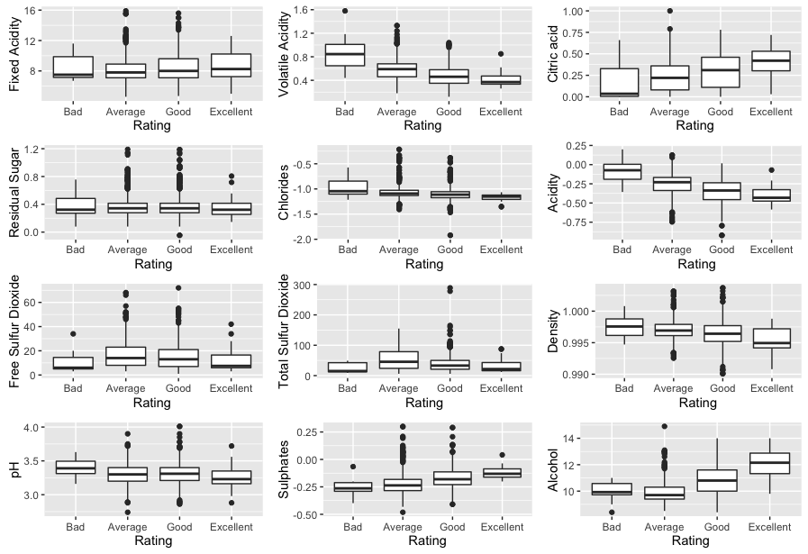


Analysis:

Based on the above plots, better quality wines have these characteristics

    *   High Alcohol
    *   High Sulphates
    *   Low pH
    *   High Fixed Acidity
    *   Low Volatile Acidity
    *   Residual sugar and sulphur dioxide doesn't have a great impact on the quality of the wine. 
    *   It appears that other acids are affecting the quality of the wine.

#Multivariate Plots

````
#Common method to generate the plot based on params.
get_geom_point <- function(x, y,xlab, ylab) {
 ggplot(data = df, 
        aes(x = x, y = y,
        color = quality)) +
        labs(x=xlab,y=ylab)+
        geom_point() 
}
#Generate the plot for the passed in params

get_geom_point(df$pH,df$alcohol,'pH', 'Alcohol') + 
                scale_y_continuous(breaks=seq(10, 14))+
                scale_x_continuous(limits=c(3, 3.75))

````


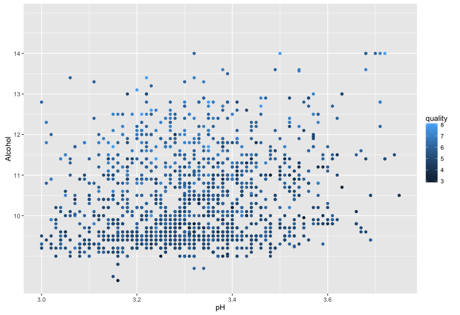
Having more Alcohol aand pH content improves the quality of the wine

````
get_geom_point(df$citric.acid,df$volatile.acidity,'Citric Acid', 'Volatile Acidity')+
                scale_y_continuous(breaks=seq(0.0, 1.2))+
                scale_x_continuous(limits=c(0.0, 0.8))

````
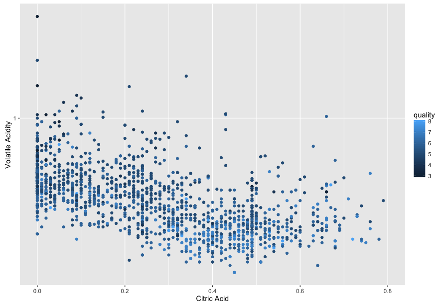
High citric acid and volatile acidity improves the quality of the wine.

````
get_geom_point(df$alcohol,log10(df$sulphates),'Alcohol', 'Sulphates')+
                scale_y_continuous(breaks=seq(-0.50, 0.25))+
                scale_x_continuous(limits=c(9, 14))

````
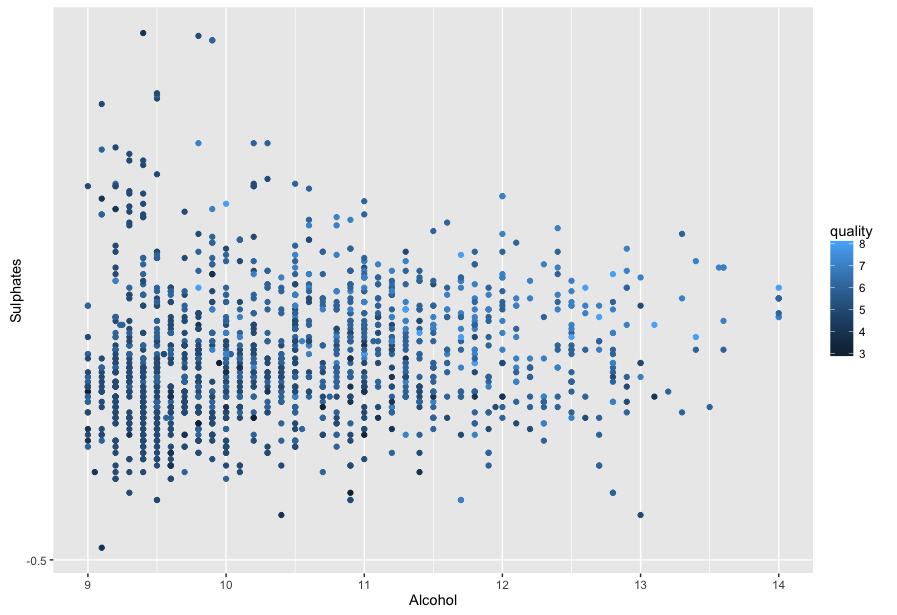

High Alcohol and sulphates improves the quality of the wine.


Analysis:
Intial scatterplots was crowded. To view it more cleary so that it doesnot appear clustered facet wrap by rating was added. This will give a better picture of different quality wines like Bad, Average, Good and Excellent. Based on these plots it looks like higher citric acid, higher sulphates and Alcohol cotnet contributes to better quality wines. pH value is not affecting the quality of the wine.
  
#Final plots and summary:
````
#Common method to generate boxplot based on params.
get_ggplot <- function(x,y, ylab){
  ggplot(data = df, aes(x = x, y = y,
                                   fill = rating)) +
                                   ylab(ylab)+
                                   xlab('Quality')+
                                   geom_boxplot()
                                   
}
#Generate the grid using the above common method with different properties
grid.arrange(get_ggplot(df$rating, df$fixed.acidity, 'Fixed Acidity') ,
             get_ggplot(df$rating, df$volatile.acidity, 'Volatile Acidity') ,
             get_ggplot(df$rating, df$citric.acid, 'Citric Acid') ,
             get_ggplot(df$rating, df$pH, 'pH'))
````

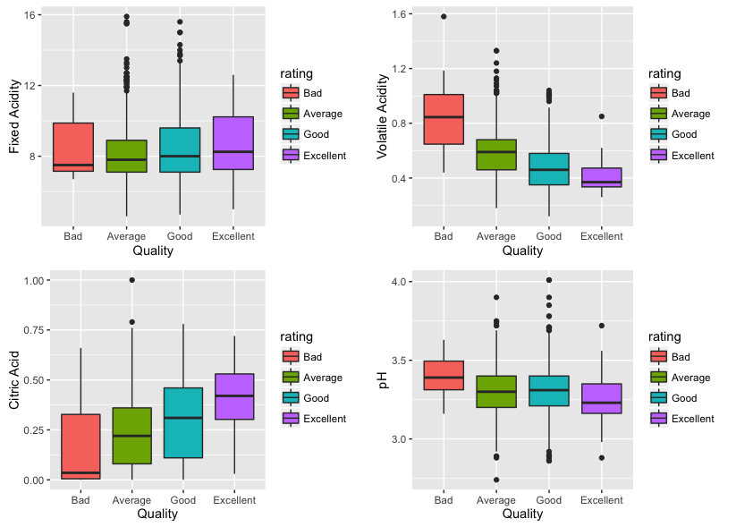

Above plots show  the effect of acidity, pH on wine quality. High Acidity can lead to better quality wines. Low pH value also leads to better quality of wine. Acetic acid is affecting the wine quality reversely. These plots show that the Citric acidity is correlated to high quality wine.


````
#Generate the plot using different properties
ggplot(data = df, aes(x = quality, y = alcohol, fill = rating))+
      geom_boxplot() +ggtitle('Alcohol Levels') +xlab('Quality')+
      ylab('Alcohol')
````
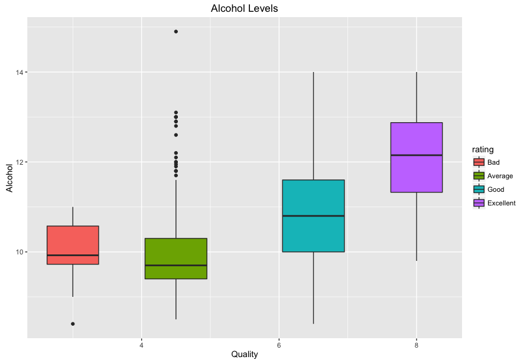


Above boxplots shows  the effect of alcohol content on wine quality. Higher alcohol content correlated with higher wine quality. Outliers show that only alchol content did not produce a better quality wine.

````
ggplot(data = subset(df, rating != 'average'),
       aes(x = volatile.acidity, y = alcohol,
                      color = rating)) +
  geom_point() +
  ggtitle('Alcohol vs. Volatile Acidity and Quality') +
  xlab('Volatile Acidity ') +
  ylab('Alcohol ')
````
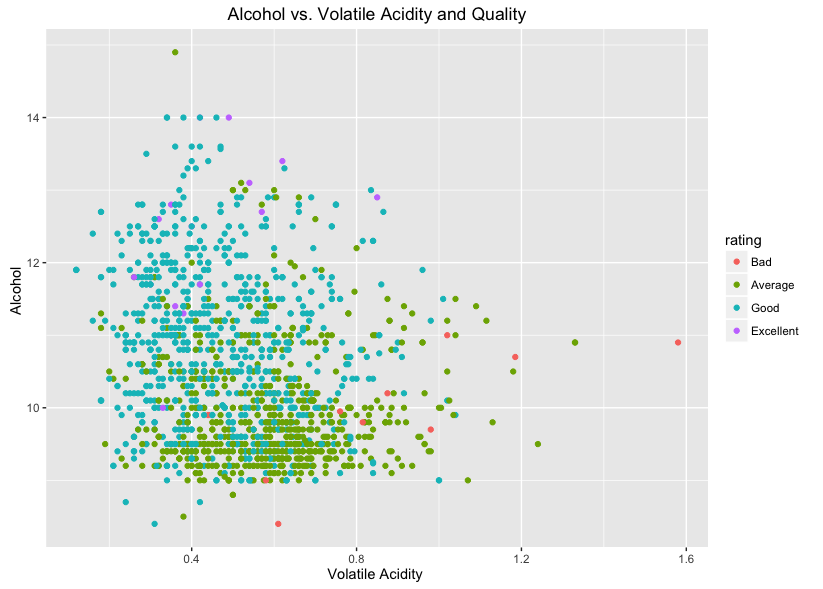

Above correlation shows that the wine quality is  affected by alcohol content and volatile acidity. It clearly shows that the volatile acidity with few exceptions affect wine quality negatively. High alcohol content and low volatile acidity will affect  wine quality positively

*   Statistical data
```{r}
summary(df$volatile.acidity)
```
```{r}
summary(df$alcohol)
```
```{r}
summary(df$quality)
```

#Reflection

When started looking at the data initialy it didn't give any clear view. After analysing the variables individually it made lot of sense. We can keep exploring the data in so many ways and keep finding new things every time. I was able to identify some of the characteristics which helped in finding the quality of the wine based on the plots. To do a better job of analysing the data we should understand all the properties well and how they are related to other properties. Using this exploratory analysis I was able to find the key factors that determins the quality of the wine. I found many different charecteristics individually but struggled  to map back to the main objective. This analysis information could be used in machine learning to identify the quality of the wine.


