#Summary

I choose the titanic data set because of my prior experience with data in my previous projects. This contains demographics and passenger information from 891 of the 2224 passengers and crew on board of Titanic. I have analyzed the dataset to answer the question based on different combinations.

#Design
While exploring the data set I believed that there could be lot of factors that could have helped Passengers more likely to survive. I have represented some of these factors visually using dimple.js. I choose four different charts to depict the factor that female passengers have survived more than the male passengers even with various combinations of group variables.

After using the other charts like pie and line in my initial submission. It looks like they were not clear to the user. I felt that bar chart is sufficient to depict the characteristics clearly for this case.

- Bar Chart to show passengers who survived based on Gender. It clearly depicts that more number of female passengers have survived than male passengers.
- Bar Chart to show passengers who survived based on Class and Gender. Even in this group it clearly shows that the female passengers survived more
- Bar Chart to show passengers who survived based on Embarkation and Gender.  Even in this group it clearly shows that the female passengers survived more
- Bar Chart to show passengers who survived based on Age group and Gender.  Even in this group it clearly shows that the female passengers survived more
* Choose pink and blue to differentiate between the genders.

#### Feedback 1
- Font size within the chart title and the html in the page were not matching.
- Rename the PClass label to Class.

#### Feedback 2
- Age attribute is not ordered in line chart.

#### Feedback 3
- Show First class, Second class, Third class instead of showing 1,2,3
- Align Legend title with the chart title

#### Reviewer feedback
- once percentages are used, the first chart can be removed as you will be able to see likelihood in the 2nd and 3rd plots (also pie charts are not that good for comparisons as you can see that it is difficult to tell the difference between first and third class)
- arrange the legend in sequential order (1st, 2nd, 3rd)
- if class is used for color (not necessary for sex), use a sequential color (light green, green, dark green for example) so that the differences are intuitive
- last I would use age buckets rather than age as it's difficult to extract much meaning from the 3rd plot (the survival rates should be more clear this way)

#Resources
dimple.js

#Data Files
- data/data/titanic_data

#Before feedback
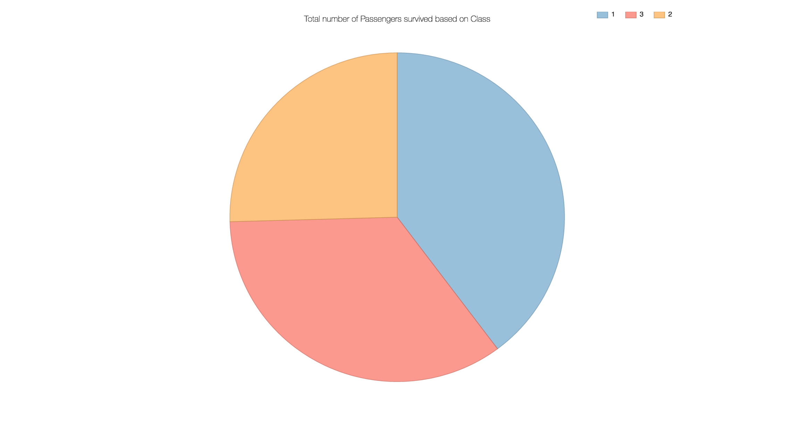
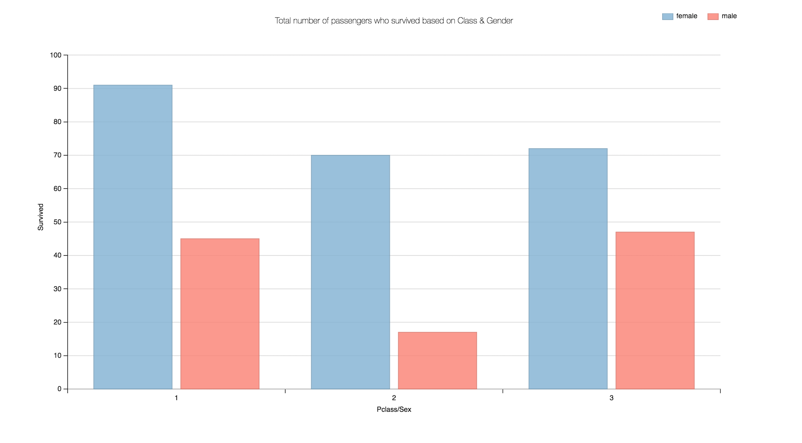
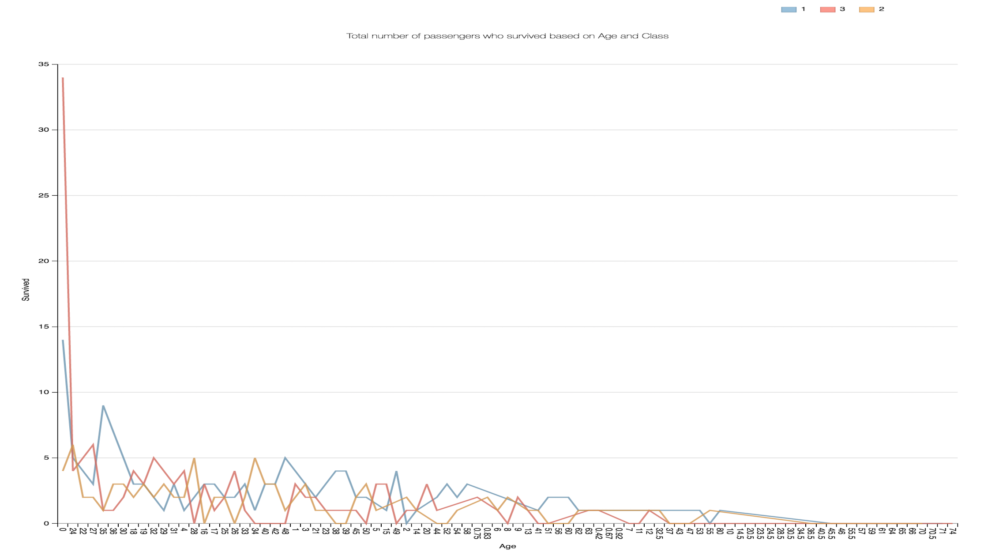

#After feedback
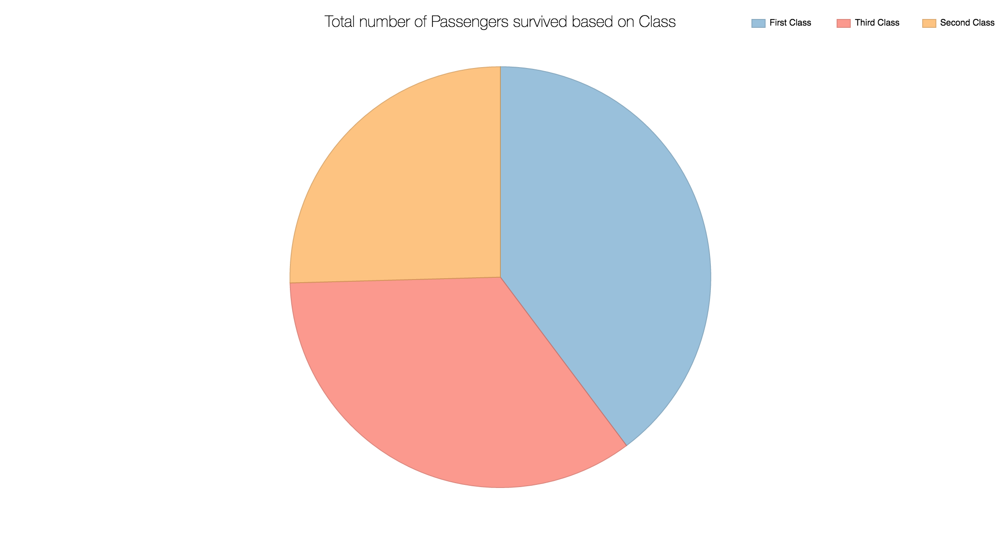
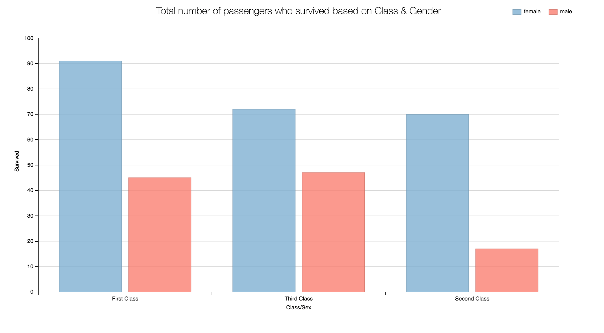
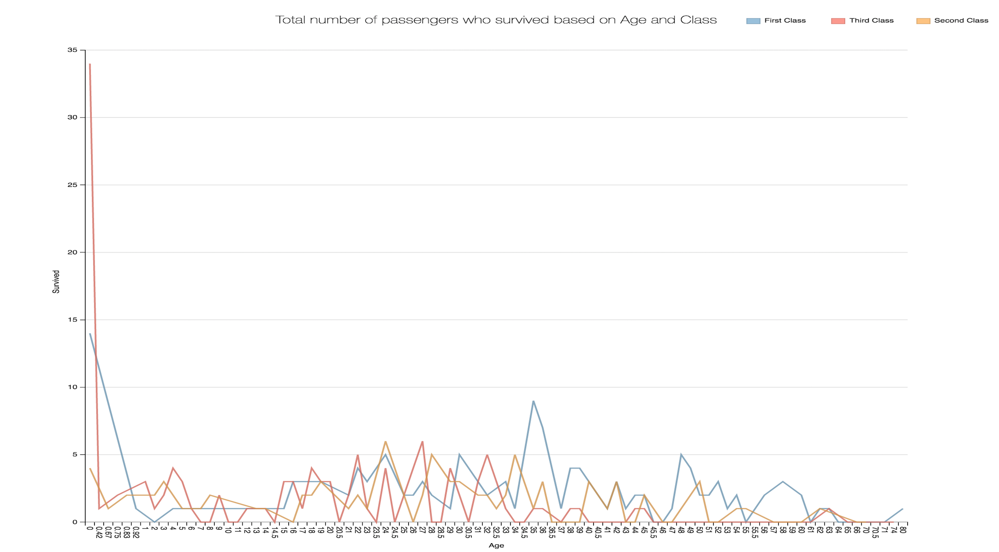

#After Review
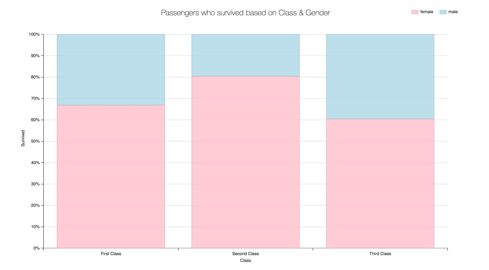
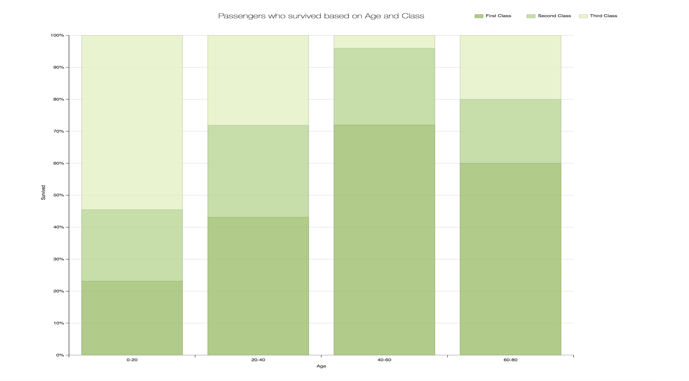
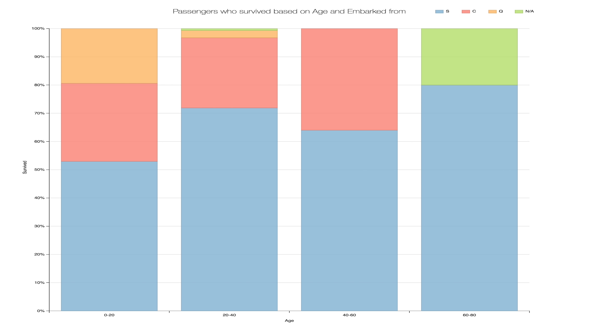

#After Review1
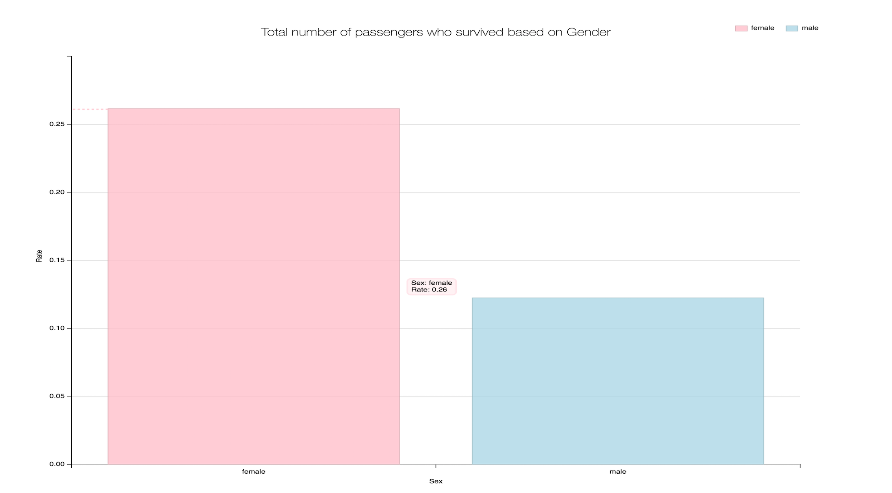
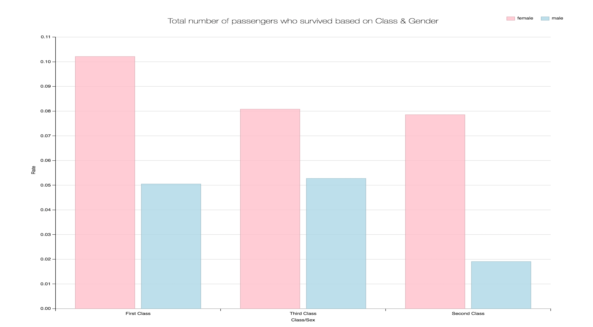
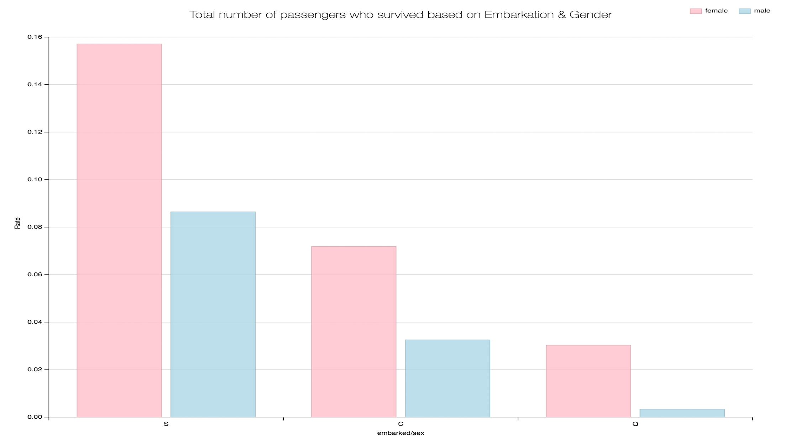
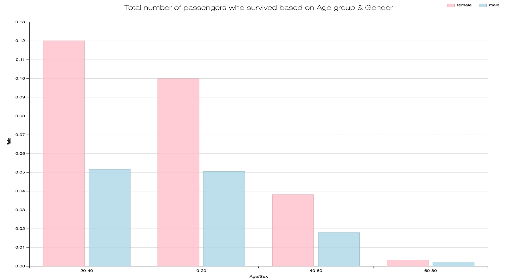
